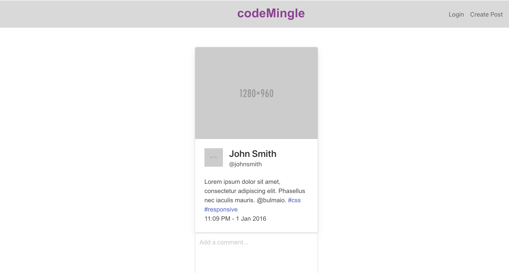

# codeMingle

## Description

A social platform for web developers to share code so that other developpers can use, comment on, and help refactor each other's code.

## User Story

AS a user,
I WANT to be able to share my code, 
SO THAT other fellow web developpers can help me refactor it.

## Acceptance Criteria

It is done when...

Given a web developer suited social media platform,

I visit the site for the first time,

I am presented with the login or sign up page,

I choose to sign up,

I am prompted to create a username and password, 

I click the sign-up button,

My user credentials are saved and I am logged into the site,

When I revisit the site at a later time and choose to sign in,

I am prompted to enter my username and password,

I am signed in to the site,

I am taken to the home page where I am presented with an image of other users’ code,

I click on the post to comment,

I enter a comment and click on the submit button while signed in,

The comment is saved and the post is updated to display the comment, the comment creator’s username, and the date created,

I click on the button to create a post, I am taken to a page to upload my code and my request for help,

I navigate to the homepage, where my post is the first to show up,

Other users are free to comment on my code,

I click on the logout option in the navigation,

I am signed out of the site,

I am idle on the site for more than a set time,

I am able to view posts and comments but I am prompted to log in again before I can add, update, or delete posts.

## Github Page

https://github.com/DariaPressley/codemingle

## Heroku Page

*insert link here

## Credits

Jane Adams

Daniel Miranda

Daria Pressley

Adam Fong

William Gomez

Bryan Swarthout &
Shawn Tschoepe

## License

Please refer to the LICENSE in the repo.

## Screenshot

